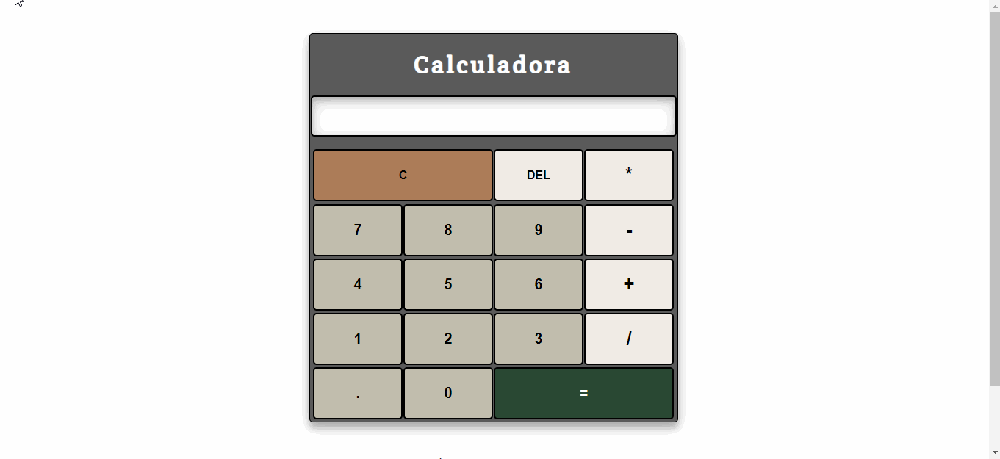

# Calculadora em JavaScript

Calculadora de operações básicas feita em JavaScript.

## Demonstração

## Como usar

- Clone o repositório

<code>git clone https://github.com/HigorChagas/calculator.git</code>

- O CSS está no arquivo <code>output.css</code>

- Caso queira utilizar o Sass como processador do CSS, será necessário instalar o Sass (pode ser pelo Chocolatey) e executar:
<code>npm install</code>

- Para compilar o Sass, vá até o diretório do arquivo <code>cd/assets/scss</code> e execute <code>sass --watch input.scss output.css</code>

## Autores

- [@HigorChagas](https://github.com/HigorChagas)

