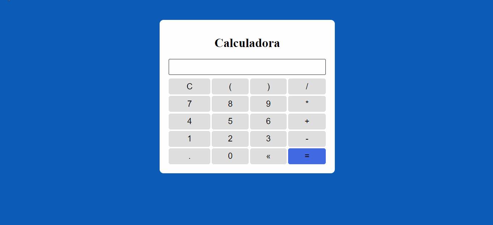

## Calculadora em Vanilla JS

## O que estou aprendendo neste projeto. 🚀
* **[JavaScript](https://developer.mozilla.org/pt-BR/docs/Web/JavaScript)**
* **[HTML](https://developer.mozilla.org/pt-BR/docs/Web/HTML)**
* **[CSS](https://developer.mozilla.org/pt-BR/docs/Web/CSS)**
* Factory Function
* **[this.](https://developer.mozilla.org/pt-BR/docs/Web/JavaScript/Reference/Operators/this)**
